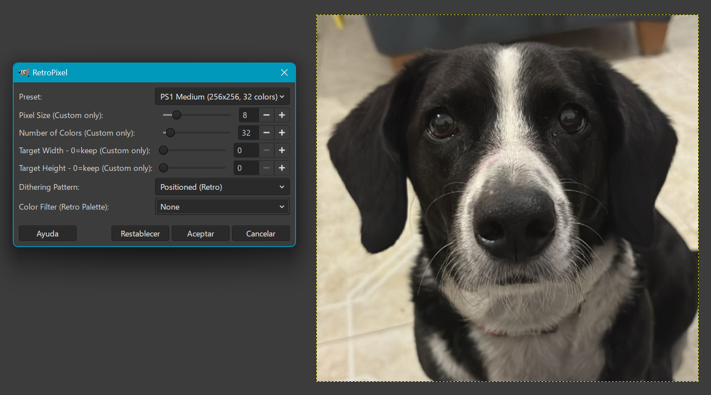
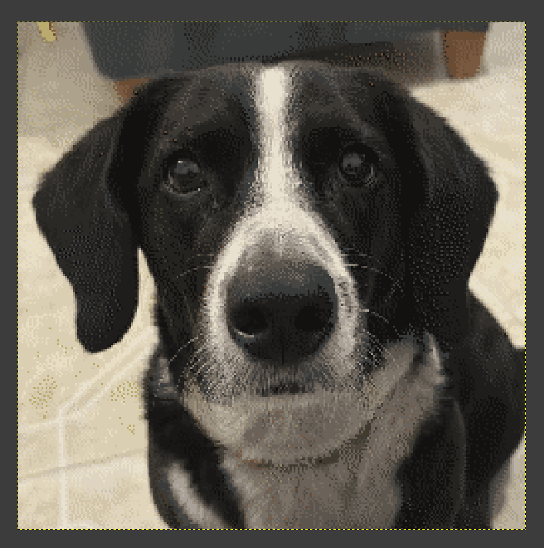

# RetroPixel - GIMP Plugin

GIMP plugin that applies PS1/N64 style pixelation effects, ideal for creating retro textures for 3D objects.

<<<<<<< HEAD
RetroPixel is only compatible with GIMP 3.0 or later.
=======
RetroPixel Effect
>>>>>>> origin/main

## Features

- **Adjustable Pixelation**: Control pixel size for the retro effect
- **Color Reduction**: Simulates the limited palette of old consoles
- **Dithering**: Adds retro-style noise for color transitions
- **Target Resolution**: Define specific dimensions for 3D textures
- **Easy to Use**: Integrated interface in GIMP

## Preview

<div align="center">
<<<<<<< HEAD
  
  <br/>
  
=======
  
  <br/>
  
>>>>>>> origin/main
</div>

## Parameters

| Parameter | Description | Range | Default |
|-----------|-------------|-------|---------|
| **Preset** | Quick settings (Custom/PS1 Low/PS1 Medium/N64/Extreme) | - | Custom |
| **Pixel Size** | Size of each pixel block (Custom only) | 2-32 | 8 |
| **Number of Colors** | Colors in the palette (Custom only) | 4-256 | 32 |
| **Target Width** | Target width in pixels, 0=keep original (Custom only) | 0-4096 | 0 |
| **Target Height** | Target height in pixels, 0=keep original (Custom only) | 0-4096 | 0 |
| **Dithering Pattern** | None/Floyd-Steinberg/Positioned | - | None (Solid) |
| **Color Filter** | Apply retro color tint (None/Red/Orange/Yellow/etc.) | - | None |

## Usage

<<<<<<< HEAD
### Windows:
- Download the code from the "Code" button at the top.
- Extract the file and save the RetroPixel folder in a location of your choice.
- Open GIMP and go to **Edit > Preferences > Folders** (at the bottom of the left-hand menu).
- Expand the option by clicking the arrow.
- Go to **Plug-ins** and add the folder where you saved the script.
- Restart GIMP.
- Test RetroPixel from **Filters > Blur > RetroPixel**.

### Linux:
- Download the code from the "Code" button at the top.
- Extract the file and save the RetroPixel folder in a location of your choice.
- Grant all permissions to the `RetroPixel.scm` script.
- Copy the `RetroPixel.scm` file to the folder `~/.config/GIMP/3.0/scripts/` (make sure it matches the version of GIMP you are using).
- Open GIMP.
- Test RetroPixel from **Filters > Blur > RetroPixel**.
=======
1. Open an image in GIMP
2. Go to **Filters → Blur → RetroPixel**
3. Choose a **Preset** or select **Custom** to adjust manually:
   - **Presets**: Pre-configured settings for quick results
     - PS1 Low-Res: 128x128, 16 colors
     - PS1 Medium: 256x256, 32 colors
     - N64 Style: 256x256, 64 colors
     - Extreme Retro: 64x64, 8 colors
   - **Custom**: Use the sliders below to configure manually
4. Adjust **Dithering Pattern**:
   - None (Solid): Clean color blocks
   - Floyd-Steinberg (Best): Smooth dithering effect
   - Positioned (Retro): Patterned dithering
5. Choose a **Color Filter** for retro tinting (optional)
6. Click **OK**
>>>>>>> origin/main

## Usage Examples

### Texture for 3D model (64x64)
```
Pixel Size: 8
Color Depth: 32
Dither Amount: 10
Target Width: 64
Target Height: 64
```

### Intense PS1 effect
```
Pixel Size: 12
Color Depth: 16
Dither Amount: 15
Target Width: 0
Target Height: 0
```

### Soft N64 effect
```
Pixel Size: 4
Color Depth: 64
Dither Amount: 5
Target Width: 256
Target Height: 256
```

## Recommended Workflow for 3D Textures

1. Prepare your original texture in high resolution
2. Apply the RetroPixel plugin with your target texture dimensions
3. Export as PNG or TGA
4. Import into your 3D engine (Unity, Unreal, Blender, etc.)
5. Set the texture filter to "Point" or "Nearest" to maintain the pixelated effect

## License

This project is licensed under the GNU General Public License v3.0. See the LICENSE file for details.

## Credits

By gessendarien 🦧 Inspired by the texture aesthetics of PlayStation 1 and Nintendo 64.

---

**Enjoy creating retro textures with RetroPixel! 🎮✨**

---

## Support the Project

If you find this plugin useful, consider supporting:

[](https://paypal.me/gessendarien)

Thank you! 💚🫰
